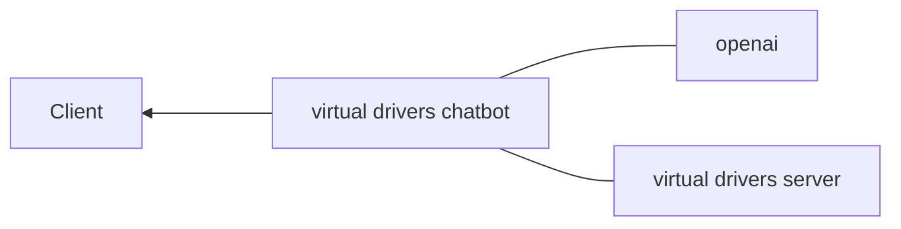

# Virtual drivers chatbot

[virtual-drivers api](https://github.com/disdong123/virtual-drivers) 를 이용하여 출/도착지 주소를 입력하면 경로를 생성하는 챗봇입니다.

openai api 의 FunctionCall 기능을 이용합니다.

### Flow

```mermaid
flowchart RL
  OpenAi[openai] --- VirtualDriversChatbot[virtual drivers chatbot] ---> Client
  VirtualDriversServer[virtual drivers server] --- VirtualDriversChatbot
```